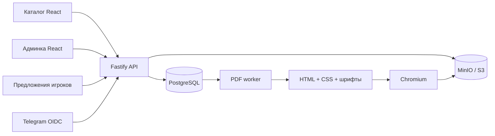

# Архитектура Bunker Studio

Модульное приложение и отдельный процесс печати. Разделение проходит по сценариям и данным, без микросервисов.

## Данные и границы

`cards` — административный черновик, включая редакторские заметки и версию каждой карточки. `workspace` — название выпуска, сводка, базовая редакция и общая ревизия. Общая ревизия увеличивается при изменении карточек или метаданных; она связывает PDF с точным снимком черновика.

`public_cards` — отдельная проекция последней принятой редакции. Обновляется в транзакции публикации вместе с записью выпуска и обновлением базы сравнения. Она не содержит `source`, `kind`, `note`. Первый импорт берёт исходную базу сравнения, а не пользовательские незавершённые правки.

`proposals` хранит автора, исходный публичный текст, предложенный текст, причину и результат рассмотрения. Для существующих карточек доверенный игрок меняет только описание. Новую карточку можно предложить с названием, типом и описанием; картинку и характеристики дополняет администратор. Принятие сверяет исходное описание с текущим черновиком и не затирает параллельную правку. Повторное рассмотрение запрещено.

`audit_log` сохраняет автора и данные изменений карточек, решений по предложениям, публикаций и доступа как технический журнал. История публикаций карточки доступна администратору и строится только из неизменяемых снимков `releases`: сравниваются последовательные выпуски, для первого — его исходная база. Запись содержит название и дату выпуска, комментарий и итоговые изменения. Автосохранения, правки только редакторских полей и выпуски без изменений карточки в эту историю не попадают. Миграционные снимки сохраняются отдельно в `import_backups`.

## Конкурентное редактирование

`PUT /api/cards/:id` принимает одну карточку и ожидаемую `version`. Сохранения разных карточек не конфликтуют; сохранение устаревшей версии одной карточки возвращает 409. Общая ревизия workspace меняется, поэтому PDF/публикация не могут использовать устаревший снимок. Импорт старого черновика сохраняет прежнюю проверку общей ревизии.

Фронтенд держит состояние карточек отдельно от списка/вкладок. Компоненты со стабильными ключами сохраняют DOM списка и его скролл. Очередь объединяет быстрые изменения и последовательно отправляет изменённые карточки. При ошибке или конфликте сохраняет браузерную копию и предлагает повторить сохранение или скачать черновик. Уход со страницы с несохранёнными изменениями вызывает предупреждение. При редактировании сводки также сохраняется браузерная копия; окончательные метаданные записываются перед сборкой PDF.

## Авторизация

Telegram Authorization Code + PKCE S256, одноразовые state и привязка к cookie браузера. Сервер обменивает code на ID token, проверяет подпись JWKS, issuer, audience, срок жизни и время выдачи. Разрешения Telegram ограничены `openid profile`, номер телефона и право отправлять сообщения не запрашиваются.

В PostgreSQL хранятся хеши случайных токенов сессии. Cookie имеет HttpOnly, SameSite=Lax и Secure при HTTPS. Изменяющие запросы требуют CSRF-токен и проверку Origin. Сессия привязана к пользователю, а его актуальная роль и блокировка читаются при запросе. Первый администратор задаётся по числовому Telegram ID, не по изменяемому username.

## Публикация и файлы

Сборка фиксирует cards, base, сводку и версию шаблона в `pdf_jobs`. Очередь использует SKIP LOCKED, аренду задания и проверку токена попытки. Объекты каждой попытки лежат под отдельными ключами, поэтому проснувшийся старый воркер не перезапишет файл завершённой попытки.

Публикация требует готового PDF для текущей ревизии и проверенной сводки. История выпусков, PDF и HTML остаются неизменными. Картинки проверяются по фактическому содержимому, нормализуются и хранятся по хешу. Публичная выдача изображения разрешена только при наличии ссылки в опубликованном каталоге; неизвестные и черновые изображения гостям не выдаются. Все ресурсы печатного документа встроены, текст экранируется.

## Основные маршруты

| Метод и маршрут | Доступ |
|---|---|
| GET /api/catalog | Все |
| GET /api/me | Все, только собственная сессия |
| GET /auth/telegram, /auth/callback | Вход |
| POST /auth/logout | Своя сессия + CSRF |
| GET /api/workspace | Администратор |
| PUT /api/cards/:id | Администратор, версия карточки |
| PATCH /api/workspace/meta | Администратор, общая ревизия |
| GET /api/cards/:id/history | Администратор |
| GET/POST /api/proposals | Доверенный / администратор |
| POST /api/proposals/:id/review | Администратор |
| POST /api/proposals/:id/withdraw | Автор |
| GET /api/users, PATCH /api/users/:id | Администратор |
| POST /api/pdf/build, GET /api/pdf/jobs/:id | Администратор |
| POST /api/releases | Администратор |
| GET /releases/:id, /releases/:id/pdf | Все |

Лимиты: один API, отдельный воркер, каталог целиком для фильтрации на клиенте, максимум 30 открытых предложений одного автора. Для большего масштаба нужны пагинация и общий ограничитель запросов. Эксплуатационные требования и оставшаяся настройка Telegram описаны в `production.md`.
